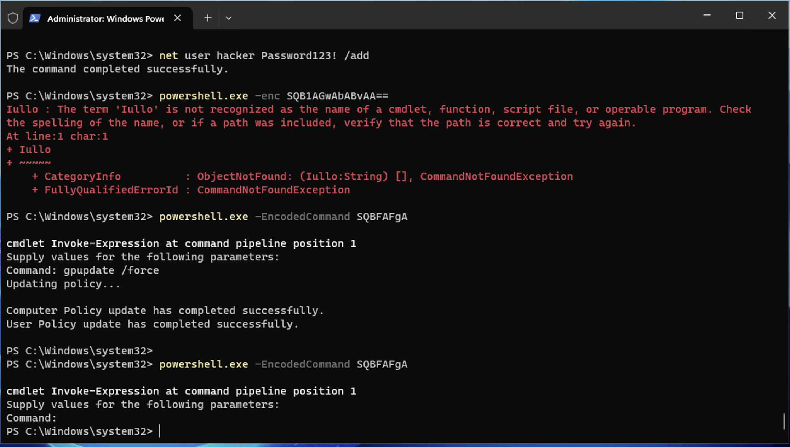
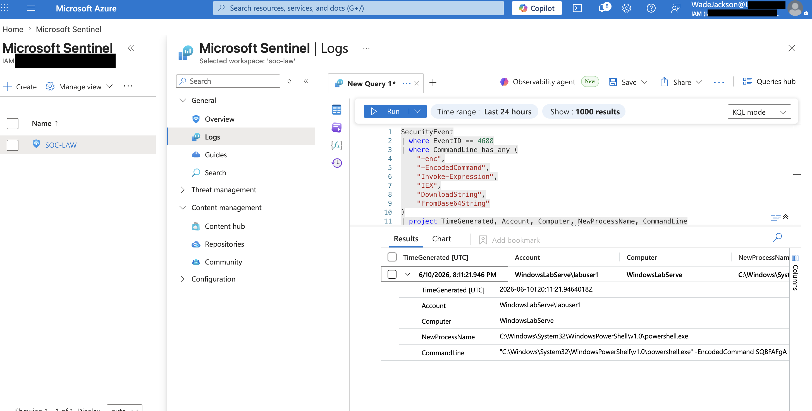

# PowerShell Obfuscation Detection Lab

## Objective

This lab demonstrates how to detect suspicious and potentially malicious PowerShell activity using Microsoft Sentinel, Sysmon, Windows Event Logs, and KQL (Kusto Query Language).  

The goal of this project was to simulate encoded PowerShell execution, generate telemetry, and create a detection query capable of identifying common indicators of PowerShell obfuscation and abuse.

---

## Tools Used

- Microsoft Sentinel
- Microsoft Azure
- Sysmon
- Windows Event Logs
- KQL (Kusto Query Language)
- PowerShell

---

## Lab Environment

- Windows Virtual Machine
- Microsoft Sentinel Workspace
- Sysmon installed for enhanced process creation logging
- Log ingestion configured into Sentinel

---

## Attack Simulation

A simulated PowerShell command utilizing encoded execution was executed within the lab environment to generate telemetry associated with suspicious PowerShell behavior.

The activity included:
- Encoded PowerShell execution
- Obfuscated command-line arguments
- Suspicious PowerShell execution patterns commonly observed during adversary activity

Example techniques detected:
- `-enc`
- `-EncodedCommand`
- `Invoke-Expression`
- `IEX`
- `FromBase64String`

---

## Detection Logic

The detection query searched Windows Security Event logs for:
- PowerShell process creation events
- Encoded PowerShell commands
- Obfuscation indicators
- Suspicious execution patterns associated with attacker tradecraft

The query focused on Event ID `4688`, which logs process creation activity.

---

## KQL Detection Query

```kql
SecurityEvent
| where EventID == 4688
| where CommandLine has_any (
    "-enc",
    "-EncodedCommand",
    "Invoke-Expression",
    "IEX",
    "DownloadString",
    "FromBase64String"
)
| project TimeGenerated, Account, Computer, NewProcessName, CommandLine
| order by TimeGenerated desc
```

---

## Detection Results

The custom KQL query successfully identified suspicious PowerShell activity generated during the attack simulation.

Microsoft Sentinel captured:
- Encoded PowerShell execution
- Suspicious command-line arguments
- PowerShell process creation telemetry
- User and host context related to the execution

This demonstrates how Sentinel can be used to detect potentially malicious PowerShell behavior commonly leveraged during cyber attacks and post-exploitation activity.

---

## Screenshots

### Attack Simulation

This screenshot shows encoded PowerShell activity being executed in the Windows VM to generate suspicious telemetry.



### Detection Results

This screenshot shows Microsoft Sentinel detecting the encoded PowerShell activity using the custom KQL query.



## MITRE ATT&CK Mapping
Technique: T1059.001 - PowerShell
Description:
Adversaries may abuse PowerShell to execute commands, download payloads, and evade detection through encoded or obfuscated command execution.

## Skills Demonstrated

- Microsoft Sentinel
- KQL Query Development
- Threat Detection
- PowerShell Analysis
- Log Analysis
- Windows Event Monitoring
- Sysmon Configuration
- Security Operations (SOC)

## Key Takeaways

- PowerShell obfuscation is a common attacker technique.
- Microsoft Sentinel can detect suspicious PowerShell activity using KQL queries.
- Sysmon provides enhanced visibility into process creation events.
- Event ID 4688 is valuable for detecting suspicious process execution.
- Proper log collection and analysis are essential for threat detection.
